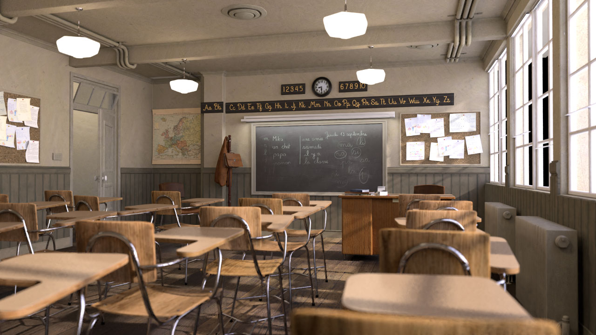
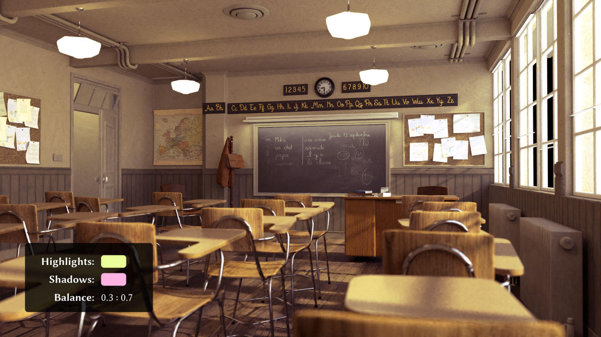
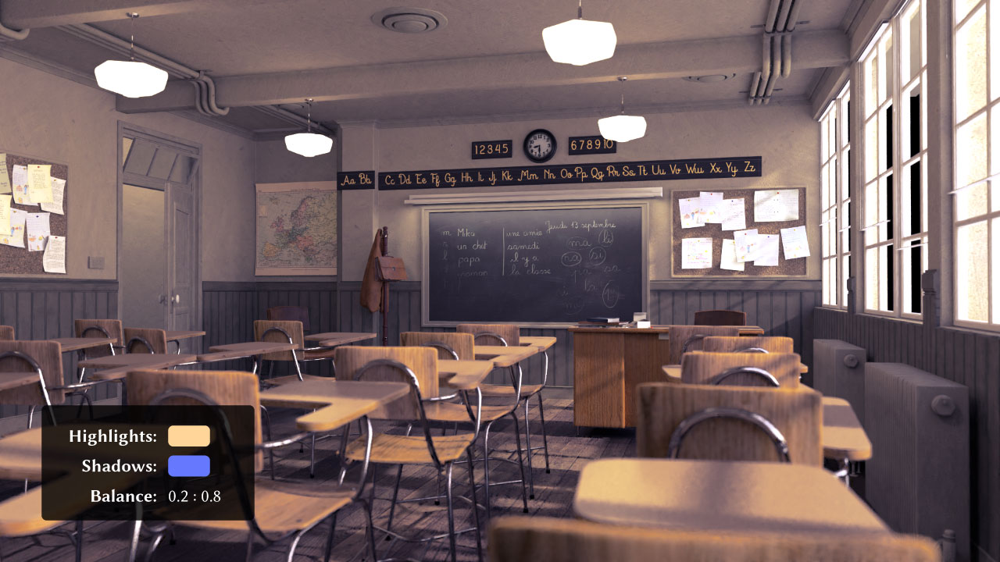

# split-toning

A Blender add-on for simulating the Split Toning effect in Adobe Lightroom/Photoshop

## Example

Original:

Adjusted (1):

Adjusted (2):

## Usage

Download the latest zip file of this repository from this link: <https://github.com/yuki-koyama/split-toning/archive/master.zip>.

## Blender Version

Currently, only Blender 2.79 is supported. We plan to support Blender 2.80 very soon ;)

## Why not using the _Color Balance_ node?

The effect of `Split Toning` itself is very similar to the `Color Balance` node in Blender. However, our Split Toning node has several different points:

- __Controllable Highlights-Shadows balance__: `Split Toning` provides a parameter called `Balance`, which controls how highlights and shadows are split.
- __Less parameters__: `Split Toning` has only five parameters and so it is easier to explore possible effects.
- __Brightness preservation__: `Split Toning` only alters the hue and saturation of the image, and does not alter the brightness (strictly speaking, the `value` of HSV). This makes it much easier to control the colorfulness and the brightness.
- __Photoshop-users friendly__: `Split Toning` is very similar to the one in Adobe Photoshop/Lightroom.

## License

GPL-3.0

## Contributing

Requests, suggestions, issues, and PRs are highly welcomed!

## Code Formatting

<https://wiki.blender.org/wiki/Style_Guide/Python>
