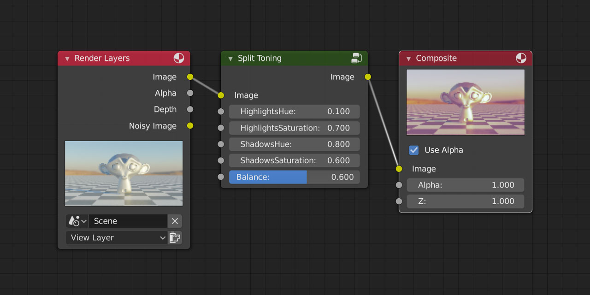

# split-toning

A Blender add-on to provide a compositor node for simulating the __Split Toning__ effect in Adobe Photoshop/Lightroom. It allows you to __easily manipulate the colors of shadows and highlights separately__.

## Example

Original:

Adjusted (1):

Adjusted (2):

## Usage

Download the latest zip file of this repository from this link: <https://github.com/yuki-koyama/split-toning/archive/master.zip>.

Open the `User Preference` widget, install the add-on by choosing the downloaded zip file (`split-toning-master.zip`) from `Install Add-on from File...`, and enable the add-on.

Go to `Compositor` and open the `Add` menu; you'll find a `Split Toning` option.

Once clicking the `Split Toning` option, a node will be added to the active node tree. The node can be linked to other nodes in a standard way.

## Supported Blender Version

__Blender 2.8__. It can also be used with Blender 2.79 although it will show some warnings.

## Why not using the _Color Balance_ node?

The effect of `Split Toning` itself is very similar to the `Color Balance` node in Blender. However, our Split Toning node has several different points:

- __Controllable Highlights-Shadows balance__: `Split Toning` provides a parameter called `Balance`, which controls how highlights and shadows are split.
- __Fewer parameters__: `Split Toning` has only five parameters and so it is easier to explore possible effects.
- __Brightness preservation__: `Split Toning` only alters the hue and saturation of the image, and does not alter the brightness (strictly speaking, the `value` of HSV). This makes it much easier to control the colorfulness and brightness.
- __Photoshop-users friendliness__: `Split Toning` is very similar to the one in Adobe Photoshop/Lightroom.

## License

GPL-3.0

## Contributing

Requests, suggestions, issues, and PRs are highly welcomed!

## Code Formatting

<https://wiki.blender.org/wiki/Style_Guide/Python>
